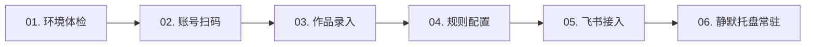

# 抖音作品数据监控 (Douyin Monitor Desktop)

<p align="center">
  
</p>

<p align="center">
  <strong>面向创作者与运营团队的高性能、轻量化抖音视频爆款追踪与飞书增量报警桌面工具</strong>
</p>

<p align="center">
  <a href="https://github.com/tauri-apps/tauri"></a>
  <a href="https://www.rust-lang.org/"></a>
  <a href="https://vuejs.org/"></a>
  <a href="https://vitejs.dev/"></a>
  <a href="https://sqlite.org/"></a>
  <a href="https://opensource.org/licenses/MIT"></a>
  
</p>

---

## 📖 项目简介

**抖音作品数据监控 (Douyin Monitor Desktop)** 是一款专为抖音短视频创作者、MCN 机构及新媒体运营团队打造的现代化桌面效率工具。

基于 **Tauri 2 + Rust + Vue 3** 构建，依托原生浏览器自动化能力直接对目标作品页面进行合规探测与数据提取，无需安装繁琐的第三方驱动或易被风控的脚本。支持自动拦截官方接口精准数据与页面 DOM 结构双重保真，精准追踪**点赞、评论、收藏、分享**四大核心互动维度的实时增量变化。

当作品数据增长突破设定阈值（例如“30 分钟内点赞增长达到 100”）时，系统会自动在第一时间向**飞书群自定义机器人**推送精美告警卡片，并自动 @ 或指派至具体负责人，助您敏锐捕获爆款起飞信号，快速联动团队跟进运营。

---

## ✨ 核心特性

- 🎯 **指定目标精准监控**
  - 仅对用户主动添加的监控名单作品执行数据轮巡，不抓取无关作品，不干扰日常账号运营。
  - 支持直接粘贴抖音 App 完整分享口令（例如 `7.28 复制打开抖音... https://v.douyin.com/xxx/`）或电脑网页长链接，系统自动识别并清洗出规范有效的作品链接。

- 📊 **四维核心互动深度追踪**
  - 精准提取与记录 👍 **点赞**、💬 **评论**、⭐ **收藏**、🔄 **分享** 四大关键数据（剔除网页端无法逐秒精确提取的虚高播放量）。
  - 内置交互式趋势图表（Sparkline），支持一键切换 24 小时 / 3 天 / 7 天多维趋势分析，历史快照精准到每一次采样点。

- ⏰ **极简自然周期智能告警**
  - **告别繁琐的冷却时间配置**：仅需设置「时间跨度（分钟）」与「增长阈值（增量）」。
  - 30 分钟内增量达到 100 即刻触发告警；通知完毕后自动进入防重保护期，只有在**下一个 30 分钟周期内再次新增 100 以上**才会再次通知，彻底杜绝骚扰报警与重复计算。

- 🤖 **飞书机器人无缝推送**
  - 在「系统设置」中即可一键配置飞书 Webhook 地址并进行连通性测试。
  - 支持飞书机器人高级安全配置：HMAC-SHA256 **签名密钥校验** 与 **自定义关键词** 过滤。
  - 告警卡片开头自动关联作品责任人（如「尊敬的负责人 张三：」），并附带可直接点击的作品跳转链接与增量差值。

- 👤 **作品负责人记忆与管理**
  - 录入作品时支持指定责任人，系统自动记忆最近常用人名，下次录入时聚焦输入框即可快速点选。
  - 支持在快捷浮层中一键删除（`×`）无效或已离职人员，保持列表整洁。

- 🛡️ **多账号沙箱隔离**
  - 为每个采集账号分配专属的 Google Chrome 用户数据沙箱（`chrome-profiles/acc-<id>`），Cookie 本地隔离存储。
  - 扫码登录一次即可长期持久保持会话有效，多账号并行运行互不串号、互不干扰。

- 🩺 **全项运行环境体检中心**
  - 内置客户端运行环境自动化诊断中心，综合体检 Microsoft Edge WebView2 运行库、Google Chrome 浏览器内核、抖音主站与短链网络连通延迟以及本地 SQLite 数据库读写健康度。
  - 异常状态自动在顶部通过警示横幅提示并提供官方下载修复入口。

- ⚡ **本地极简与自动滚动覆盖**
  - 采用嵌入式 `rusqlite`（WAL 高并发模式），内存占用通常低于 80MB，CPU 占用极低。
  - 默认开启 7 天自动滚动覆盖清理，自动淘汰超期历史快照并执行 SQLite VACUUM 整理磁盘，保障长期挂机轻量稳定。

- 🪟 **系统托盘与开机静默自启**
  - 点击关闭按钮自动最小化至 Windows 系统托盘继续保持每 10 分钟定时调度，不打扰桌面日常工作。
  - 支持 Windows 用户级开机自启动（`HKCU Run` 注册表），电脑开机后在托盘静默就绪，无需人工干预。

---

## 📱 飞书告警卡片样式

触发报警后，飞书群将收到如下格式规范的文本卡片：

```text
尊敬的负责人 张三：

监测到您发布的媒体内容有新的媒体增量

作者：账号名称 | ▶ 爆款视频标题示例 https://www.douyin.com/video/7123456789012345678

发布时间：2026-03-28 17:48

👍1,250(+350)|💬186(+42)

⭐890(+120)|🔄320(+55)
```

---

## 🛠️ 技术选型

| 架构层级 | 技术栈 | 说明 |
| :--- | :--- | :--- |
| **桌面运行时** | [Tauri 2.12](https://v2.tauri.app/) | 原生系统窗口封装，安全无沙箱膨胀 |
| **后端开发语言** | [Rust 1.85+](https://www.rust-lang.org/) | 内存安全、超低系统资源开销、高并发异步运行时（Tokio） |
| **前端框架** | [Vue 3](https://vuejs.org/) + [TypeScript](https://www.typescriptlang.org/) | Composition API、强类型安全 |
| **UI 与组件库** | [Tailwind CSS](https://tailwindcss.com/) + [Radix Vue](https://www.radix-vue.com/) | 现代化深色质感界面、无冗余运行时开销 |
| **图标库** | [Lucide Icons](https://lucide.dev/) | 矢量线性图标规范 |
| **浏览器自动化** | 原生 Chrome DevTools 协议通道 | 基于 WebSocket 通信，轻量高效，无外部可执行体侵入 |
| **本地数据库** | [rusqlite](https://github.com/rusqlite/rusqlite) (SQLite WAL) | 嵌入式单文件数据库，支持自动覆盖维护与 VACUUM |
| **网络推送** | reqwest + hmac + sha2 | 飞书 Webhook 与 HMAC-SHA256 签名机制 |

---

## 🖥️ 环境要求

- **操作系统**：Windows 10 / Windows 11（64 位桌面系统）
- **浏览器**：正版 [Google Chrome](https://www.google.cn/chrome/)（用于自动化执行数据采集沙箱）
- **UI 运行时**：Microsoft Edge WebView2 Runtime（Windows 10/11 系统通常已自带）

---

## 🚀 快速上手

### 方式一：下载预编译安装包（普通用户推荐）

1. 前往 GitHub 仓库的 [Releases](https://github.com/your-username/douyin-monitor/releases) 页面；
2. 下载最新版本的 Windows 安装程序（如 `douyin-monitor_0.1.0_x64-setup.exe` 或 `.msi`）；
3. 双击运行并按照提示完成安装。

---

### 方式二：从源码构建开发（开发者）

#### 1. 前置开发环境准备
- 安装 [Rust](https://rustup.rs/)（1.85 或更高版本）；
- 安装 [Node.js](https://nodejs.org/)（v20+）及包管理器 [pnpm](https://pnpm.io/)（`npm i -g pnpm`）。

#### 2. 克隆代码仓库并安装依赖
```bash
# 克隆仓库
git clone https://github.com/your-username/douyin-monitor.git
cd douyin-monitor

# 安装前端依赖
pnpm install
```

#### 3. 启动本地开发调试
```bash
# 启动 Tauri 开发模式（前端 Vite 热重载 + 后端编译）
pnpm tauri dev
```

#### 4. 代码质量检查与单元测试
```bash
# 前端类型检查
pnpm typecheck

# 后端全量测试（包含 30 项单元测试与集成测试）
cd src-tauri && cargo test --lib
```

#### 5. 打包生产安装包
```bash
# 编译并生成生产可执行文件与 Windows 安装包
pnpm tauri build
```
打包产物将位于：`src-tauri/target/release/bundle/nsis/` 或 `msi/`。

---

## 📚 详细使用流程



1. **运行环境体检**：首次打开应用进入「系统设置」，全项体检中心将自动检查 WebView2、Google Chrome、网络质量与磁盘健康，确认全项通过。
2. **添加采集账号**：进入「采集账号」页点击「新增采集账号」，输入名称后点击「创建并打开登录」，在弹出的独立浏览器窗口中使用手机抖音 App 扫码登录。登录成功后关闭窗口即可。
3. **录入监控作品**：进入「监控作品」页点击「新增监控视频」，选择采集账号，粘贴视频长短链（可直接粘贴分享文案），指定责任人后保存。
4. **配置报警规则**：进入「报警规则」页点击「新建规则」，设定监控指标（点赞/评论/收藏/分享）、时间跨度（例如 30 分钟）与增长阈值（例如 100）。
5. **配置飞书群机器人**：在飞书群添加「自定义机器人」，获取 Webhook 地址后粘贴到「系统设置」中的对应输入框，点击「测试连接」验证通知通畅。
6. **自动化静默运行**：在系统设置中勾选「开机自启动」，点击主窗口右上角关闭按钮，程序将常驻托盘并保持固定每 10 分钟自动调度采集与精准预警。

---

## 📂 项目结构

```text
douyin-monitor/
├── src/                          # Vue 3 前端源码
│   ├── api/                      # Tauri IPC 前后端通信封装接口
│   ├── components/               # 通用业务组件 (图表、分页、告警横幅、UI 组件)
│   ├── store/                    # 响应式全局状态机与事件总线
│   ├── types/                    # TypeScript 类型定义契约
│   ├── utils/                    # 格式化、口令清洗等工具函数
│   ├── views/                    # 核心页面视图
│   │   ├── DashboardView.vue     # 系统概览与仪表盘
│   │   ├── AccountsView.vue      # 采集账号与登录沙箱管理
│   │   ├── WorksView.vue         # 监控作品管理与多维趋势图
│   │   ├── RulesView.vue         # 自然周期增量报警规则
│   │   ├── AlertsView.vue        # 报警通知记录与重发
│   │   ├── SettingsView.vue      # 系统设置、环境体检与飞书配置
│   │   ├── LogsView.vue          # 安全脱敏运行日志
│   │   └── GuideView.vue         # 内置图文实战使用指南
│   ├── App.vue                   # 主桌面框架导航
│   └── main.ts                   # 应用前端入口
├── src-tauri/                    # Rust 后端源码
│   ├── src/
│   │   ├── cdp.rs                # 浏览器发现与独立端口协商启动
│   │   ├── cdp_client.rs         # 原生 CDP WebSocket 协议客户端
│   │   ├── cdp_page.rs           # 页面级会话控制（导航、求值、滚动）
│   │   ├── collector.rs          # 自动化采集生命周期与探针
│   │   ├── collect.rs            # 定时采集编排调度与入库
│   │   ├── rules.rs              # 动态基线增量判定与飞书消息拼装
│   │   ├── repo_alert.rs         # 报警与通知历史 SQLite 数据仓储
│   │   ├── repo_monitored.rs     # 监控作品名单数据仓储
│   │   ├── repo_work.rs          # 历史快照数据与覆盖清理
│   │   ├── env_check.rs          # 运行环境 4 维体检诊断引擎
│   │   ├── feishu.rs             # 飞书 Webhook 推送与 HMAC 签名引擎
│   │   ├── scheduler.rs          # 10 分钟定时调度轮巡核心
│   │   ├── autostart.rs          # Windows 开机自启注册表管理
│   │   ├── logging.rs            # 日志环形缓冲区与敏感词脱敏
│   │   ├── commands.rs           # Tauri IPC 命令注册中心
│   │   └── lib.rs                # 后端应用启动与托盘事件管理
│   ├── Cargo.toml                # Rust 依赖声明
│   └── tauri.conf.json           # Tauri 应用配置
├── LICENSE                       # MIT 开源协议
├── package.json                  # 前端工程配置
└── README.md                     # 项目使用与开发说明
```

---

## ⚖️ 合规原则与免责声明

1. **合法合规使用**：本软件仅供短视频创作者、运营人员对自己合法拥有知识产权或已获得正式授权的作品进行运行监测与数据归档，严禁用于任何未经授权的批量爬取、商业倒卖或针对第三方的恶意扫描行为。
2. **平台规则尊重**：本工具基于公开展示的网页视图采用本地自动化技术渲染读取，不提供任何破解接口、绕过平台反爬风控、验证码代打或批量注册登录的功能。请使用者严格遵守抖音官方《用户服务协议》与平台相关规范。
3. **免责条款**：使用者因违反法律法规或平台规则导致的一切纠纷、法律责任或账号受限风险，均由使用者自行承担，本项目开发者不承担任何直接或间接法律责任。

---

## 🤝 参与贡献

欢迎提交 Issue 与 Pull Request！

1. Fork 本仓库；
2. 新建功能分支 (`git checkout -b feature/AmazingFeature`)；
3. 提交代码变更 (`git commit -m 'Add some AmazingFeature'`)；
4. 推送至分支 (`git push origin feature/AmazingFeature`)；
5. 发起 Pull Request。

---

## 📄 开源协议

本项目基于 **[MIT License](LICENSE)** 协议开源。
